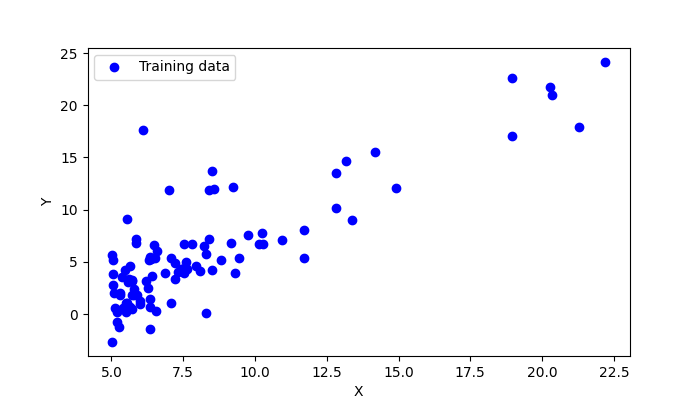
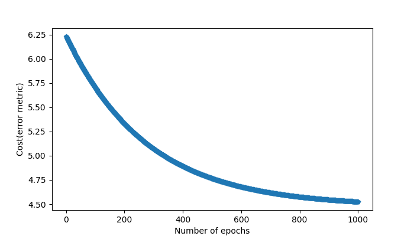
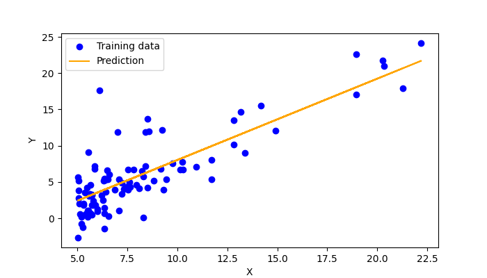

# Linear Regression with One Variable
## training data

## training logs

## Predictions

# Linear Regression with Multiple Variables

Feature scaling is necessary otherwise the model wasn't fitting to the data.
